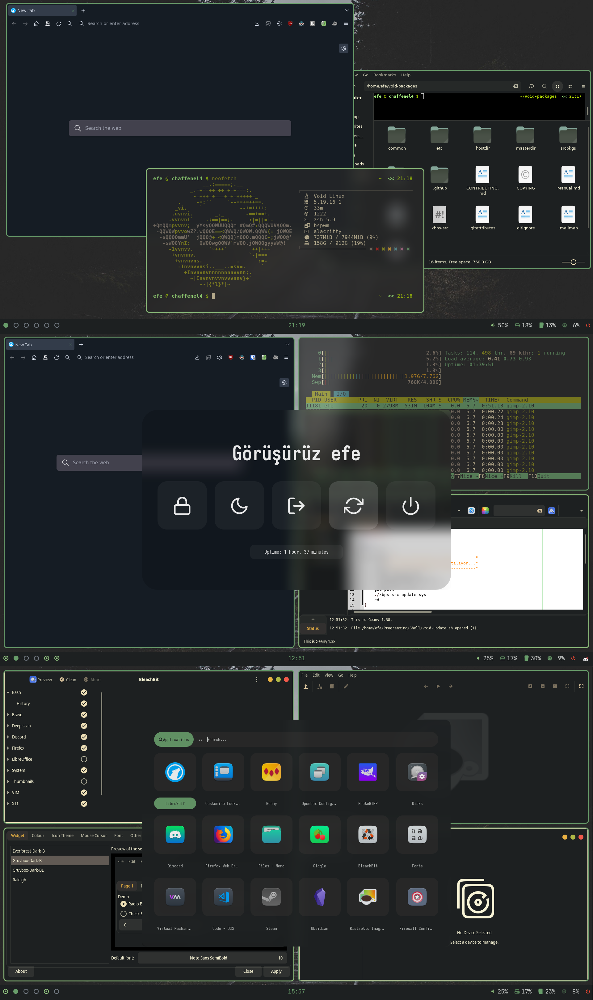

# LINUX CONFIG DOSYALARI

Dotfiles'ı bile doğru yazamayan birinin reposun dan çok da birşey beklenemez zaten.Sağdan soldan dızladığım config dosyaları(bazıları benim ama!).

---
### BSPWM VOIDLINUX RICE

---

__Dağıtım__: [Voidlinux](https://voidlinux.org/)

__Pencere Yöneticisi__: [BSPWM](https://github.com/baskerville/bspwm)

__Bar__: [Polybar](https://github.com/polybar/polybar) 

__Terminal__: [Alacritty](https://github.com/alacritty/alacritty)

__Menüler__: [Rofi](https://github.com/adi1090x/rofi)

__Kabuk__: zsh

__Fetch__: [Neofetch](https://github.com/dylanaraps/neofetch)

__Compositor__ : [picom-ibhagwan-git](https://aur.archlinux.org/packages/picom-ibhagwan-git) , VoidLinux için [xbps-src şablonu](https://github.com/ibhagwan/picom-ibhagwan-template)

__Genel Ağ Tarayıcısı__: [Librewolf](https://librewolf.net/)

__Dosya Yöneticis__: [Nemo](https://github.com/linuxmint/nemo)

__GTK Teması__: [Gruvbox](https://github.com/Fausto-Korpsvart/Gruvbox-GTK-Theme)

__Simge Teması__:[Gruvbox-icons](https://www.gnome-look.org/p/1681460)

__Cusor Teması__: [capitaine-cursors](https://www.gnome-look.org/p/1818760)